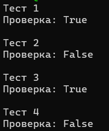

# Практика 8. Транспортный уровень

## Реализация протокола Stop and Wait (8 баллов)
Реализуйте свой протокол надежной передачи данных типа Stop and Wait на основе ненадежного
транспортного протокола UDP. В вашем протоколе, реализованном на прикладном уровне,
отправитель отправляет пакет (frame) с данными, а затем ожидает подтверждения перед
продолжением.

**Клиент**
- отправляет пакет и ожидает подтверждение ACK от сервера в течение заданного времени (тайм-аута)
- если ACK не получен, пакет отправляется снова
- все пакеты имеют номер (0 или 1) на случай, если один из них потерян

**Сервер**
- ожидает пакеты, отправляет ACK, когда пакет получен
- отправленный ACK должен иметь тот же номер, что и полученный пакет

Вы можете использовать схему, которая была рассмотрена на лекции в рамках обсуждения
протокола rdt3.0, как пример:

### А. Общие требования (5 баллов)
- В качестве базового протокола используйте UDP. Поддержите имитацию 30% потери
  пакетов. Потеря может происходить в обоих направлениях (от клиента серверу и от
  сервера клиенту).
- Должен быть поддержан настраиваемый таймаут.
- Должна быть обработка ошибок (как на сервере, так и на клиенте).
- В качестве демонстрации работоспособности вашего решения передайте через свой
  протокол файл (от клиента на сервер), разбив его на несколько пакетов перед отправкой
  на стороне клиента и собрав из отдельных пакетов в единый файл на стороне сервера.
  Файл и размеры пакетов выберите самостоятельно.

Приложите скриншоты, подтверждающие работоспособность программы.

#### Демонстрация работы
todo

### Б. Дуплексная передача (2 балла)
Поддержите возможность пересылки данных в обоих направлениях: как от клиента к серверу, так и
наоборот. 

Продемонстрируйте передачу файла от сервера клиенту.

#### Демонстрация работы
todo

### В. Контрольные суммы (1 балл)
UDP реализует механизм контрольных сумм при передаче данных. Однако предположим, что
этого нет. Реализуйте и интегрируйте в протокол свой способ проверки корректности данных
на прикладном уровне (для этого вы можете использовать результаты из следующего задания
«Контрольные суммы»).

## Контрольные суммы (2 балла)
Методы, основанные на использовании контрольных сумм, обрабатывают $d$ разрядов данных как
последовательность $k$-разрядных целых чисел.
Наиболее простой метод заключается в простом суммировании этих $k$-разрядных целых чисел и
использовании полученной суммы в качестве битов определения ошибок. Так работает алгоритм
вычисления контрольной суммы, принятый в Интернете, — байты данных группируются в $16$-
разрядные целые числа и суммируются. Затем от суммы берется обратное значение (дополнение
до $1$), которое и помещается в заголовок сегмента.

Получатель проверяет контрольную сумму, складывая все числа из данных (включая контрольную
сумму), и сравнивает результат с числом, все разряды которого равны $1$. Если хотя бы один из
разрядов результата равен $0$, это означает, что произошла ошибка.
В протоколах TCP и UDP контрольная сумма вычисляется по всем полям (включая поля заголовка и
данных).

Реализуйте функцию для подсчета контрольной суммы, а также функцию для проверки, что
данные соответствуют контрольной сумме.

**Требования**
- Функция 1 принимает на вход массив байт и возвращает контрольную сумму (число).
- Функция 2 принимает на вход массив байт и контрольную сумму и проверяет,
соответствует ли сумма переданным данным. Размер входного массива ограничен сверху
числом байтов ($= L$), однако данные могут поступать разной длины ($\le L$).

Добавьте два-три теста, покрывающих как случаи
корректной работы, так и случаи ошибки в данных (сбой битов). Вы можете не использовать
тестовые фреймворки и реализовать тестовые сценарии в консольном приложении.

## Задачи

### Задача 1 (2 балла)
Пусть $T$ (измеряется в RTT) обозначает интервал времени, который TCP-соединение тратит на увеличение размера окна перегрузки с $\frac{W}{2}$ до $W$, где $W$ – это максимальный размер окна перегрузки. Докажите, что $T$ – это функция от средней пропускной способности TCP.

#### Решение
В стандартном TCP после потери окно перегрузки уменьшается примерно в два раза: $W \rightarrow \frac{W}{2}$. Затем TCP снова увеличивает окно линейно, примерно на $1$ MSS за каждый RTT. Поэтому, чтобы окно выросло от $\frac{W}{2}$ до $W$, нужно увеличить его на $W - \frac{W}{2} = \frac{W}{2}$. Так как за один RTT окно растёт на $1$, получаем $T = \frac{W}{2}$.
Среднее окно за такой цикл равно: $\frac{\frac{W}{2} + W}{2} = \frac{3W}{4}$. Тогда средняя пропускная способность TCP равна $B = \frac{3W}{4} \cdot \frac{MSS}{RTT}$. Отсюда $W = \frac{4B \cdot RTT}{3MSS}$.
Так как $T = \frac{W}{2}$, получаем $T = \frac{2B \cdot RTT}{3MSS}$. Значит, $T$ действительно является функцией от средней пропускной способности TCP.

### Задача 2 (3 балла)
Рассмотрим задержку, полученную в фазе медленного старта TCP. Рассмотрим клиент и веб-сервер, напрямую соединенные одним каналом со скоростью передачи данных $R$.
Предположим, клиент хочет получить от сервера объект, размер которого точно равен $15 \cdot S$,
где $S$ – это максимальный размер сегмента.
Игнорируя заголовки протокола, определите время извлечения объекта (общее время
задержки), включая время на установление TCP-соединения (предполагается, что RTT - константа), если:
1. $\dfrac{4S}{R} > \dfrac{S}{R} + RTT > \dfrac{2S}{R}$
2. $\dfrac{𝑆}{𝑅} + 𝑅𝑇𝑇 > \dfrac{4𝑆}{𝑅}$
3. $\dfrac{𝑆}{𝑅} > 𝑅𝑇𝑇$

#### Решение

Объект имеет размер $15S$. В фазе медленного старта TCP окно растёт так: $1, 2, 4, 8, \ldots$. Так как $1 + 2 + 4 + 8 = 15$, весь объект будет передан за четыре окна: сначала $1$ сегмент, потом $2$ сегмента, потом $4$ сегмента и потом $8$ сегментов.
Обозначим $t = \frac{S}{R}$. Это время передачи одного сегмента. На установление TCP-соединения нужен один RTT.

В первом случае дано $\frac{4S}{R} > \frac{S}{R} + RTT > \frac{2S}{R}$, то есть $4t > t + RTT > 2t$. Это значит, что после первых двух окон серверу приходится ждать ACK, а после третьего окна уже нет. Поэтому время будет $T = RTT + t + RTT + 2t + RTT + 4t + 8t$. После сложения получаем $T = 3RTT + 15t$, то есть $T = 3RTT + \frac{15S}{R}$.

Во втором случае дано $\frac{S}{R} + RTT > \frac{4S}{R}$, то есть $t + RTT > 4t$. ACK приходит поздно, поэтому сервер ждёт после каждого из первых трёх окон. Тогда $T = RTT + t + RTT + 2t + RTT + 4t + RTT + 8t$. После сложения получаем $T = 4RTT + 15t$, то есть $T = 4RTT + \frac{15S}{R}$.

В третьем случае дано $\frac{S}{R} > RTT$, то есть $t > RTT$. Передача сегментов занимает больше времени, чем ожидание ACK. Поэтому ACK успевают приходить, пока сервер ещё передаёт данные, и дополнительных простоев нет. Тогда общее время равно $T = RTT + 15t$, то есть $T = RTT + \frac{15S}{R}$.

### Задача 3 (2 балла)
Рассмотрим модификацию алгоритма управления перегрузкой протокола TCP. Вместо
аддитивного увеличения, мы можем использовать мультипликативное увеличение. TCP-отправитель увеличивает размер своего окна в $(1 + a)$ раз (где $a$ - небольшая положительная
константа: $0 < a < 1$), как только получает верный ACK-пакет.
Найдите функциональную зависимость между частотой потерь $L$ и максимальным размером окна
перегрузки $W$. Утверждается, что для этого измененного протокола TCP, независимо от средней
пропускной способности TCP-соединения всегда требуется одинаковое количество времени для
увеличения размера окна перегрузки с $\frac{W}{2}$ до $W$.

#### Решение
Теперь окно растёт не линейно, а мультипликативно. То есть каждый раз оно умножается на $1+a$, где $0 < a < 1$.
Пусть в начале окно равно $\frac{W}{2}$. Через $T$ шагов оно станет равным $\frac{W}{2}(1+a)^T$. Нужно, чтобы оно выросло до $W$, поэтому $\frac{W}{2}(1+a)^T = W$. Тогда $(1+a)^T = 2$, $T = \log_{1+a}2$.
В этой формуле нет $W$, значит, время роста окна от $\frac{W}{2}$ до $W$ зависит только от параметра $a$, а не от размера окна и не от средней пропускной способности TCP.
За один цикл TCP передаёт примерно сумму окон: $\frac{W}{2} + \frac{W}{2}(1+a) + \frac{W}{2}(1+a)^2 + \ldots$. Это геометрическая прогрессия, и её сумма примерно равна $N = \frac{W}{2a}$.
Если одна потеря происходит примерно один раз за цикл, то частота потерь равна $L \approx \frac{1}{N}$. Значит, $L \approx \frac{2a}{W}$.

### Задача 4. Расслоение TCP (2 балла)
Для облачных сервисов, таких как поисковые системы, электронная почта и социальные сети,
желательно обеспечить малое время отклика если конечная система расположена далеко от датацентра, то значение RTT будет большим, что может привести к неудовлетворительному времени
отклика, связанному с этапом медленного старта протокола TCP.
Рассмотрим задержку получения ответа на поисковый запрос. Обычно серверу требуется три окна
TCP на этапе медленного старта для доставки ответа. Таким образом, время с момента, когда
конечная система инициировала TCP-соединение, до времени, когда она получила последний
пакет в ответ, составляет примерно $4$ RTT (один RTT для установления TCP-соединения, плюс три
RTT для трех окон данных) плюс время обработки в дата-центре. Такие RTT задержки могут
привести к заметно замедленной выдаче результатов поиска для многих запросов. Более того,
могут присутствовать также и значительные потери пакетов в сетях доступа, приводящие к
повторной передаче TCP и еще большим задержкам.

Один из способов смягчения этой проблемы и улучшения восприятия пользователем
производительности заключается в том, чтобы:
- развернуть внешние серверы ближе к пользователям
- использовать расслоение TCP путем разделения TCP-соединения на внешнем сервере.
При расслоении клиент устанавливает TCP-соединение с ближайшим внешним сервером, который
поддерживает постоянное TCP-соединение с дата-центром с очень большим окном перегрузки TCP.

При использовании такого подхода время отклика примерно равно:
$$4 \cdot RTT_{FE} + RTT_{BE} + \text{ время обработки}~~~~~~~(1)$$
где $RTT_{FE}$ — время оборота между клиентом и внешним сервером, и $RTT_{BE}$ — время оборота
между внешним сервером и дата-центром (внутренним сервером). Если внешний сервер закрыт
для клиента, то это время ответа приближается к $RTT$ плюс время обработки, поскольку значение
$RTT_{FE}$ ничтожно мало и значение $RTT_{BE}$ приблизительно равно $RTT$. В итоге расслоение TCP
может уменьшить сетевую задержку, грубо говоря, с $4 \cdot RTT$ до $RTT$, значительно повышая
субъективную производительность, особенно для пользователей, которые расположены далеко
от ближайшего дата-центра.

Расслоение TCP также помогает сократить задержку повторной передачи TCP, вызванную
потерями в сетях.

Докажите утверждение $(1)$. 

#### Решение
Без расслоения TCP клиент общается напрямую с дата-центром. Ответ обычно приходит примерно за $4RTT + \text{время обработки}$. Здесь $1RTT$ нужен на установление TCP-соединения, а ещё примерно $3RTT$ нужны на передачу ответа тремя окнами TCP в фазе медленного старта.

Рассмотрим расслоение TCP. Клиент соединяется не сразу с дата-центром, а с ближайшим внешним сервером. Между клиентом и внешним сервером RTT равно $RTT_{FE}$. На этом участке всё ещё нужен медленный старт: $1RTT_{FE}$ на установление соединения и ещё $3RTT_{FE}$ на передачу трёх окон данных. Поэтому на участке клиент — внешний сервер получаем $4RTT_{FE}$.

Дальше внешний сервер должен связаться с дата-центром. Но между внешним сервером и дата-центром уже есть постоянное TCP-соединение с большим окном перегрузки, поэтому заново проходить медленный старт не нужно. На этот участок требуется примерно один оборот, то есть $RTT_{BE}$. Также нужно добавить время обработки запроса в дата-центре.

Итого получаем $T = 4RTT_{FE} + RTT_{BE} + \text{время обработки}$.
