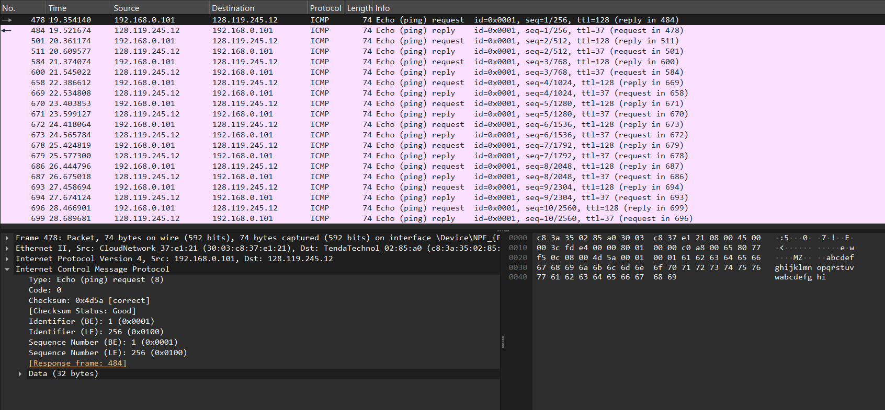
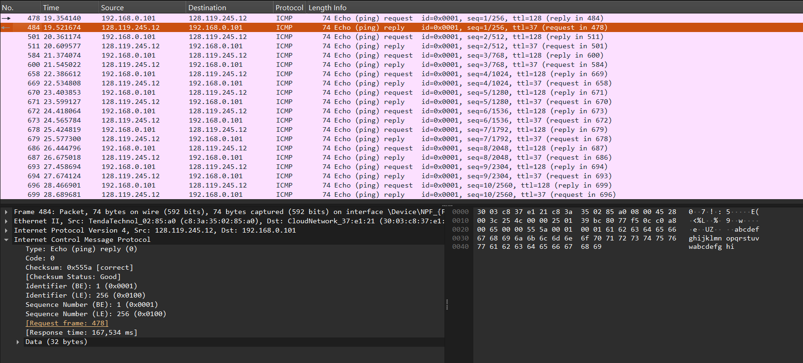
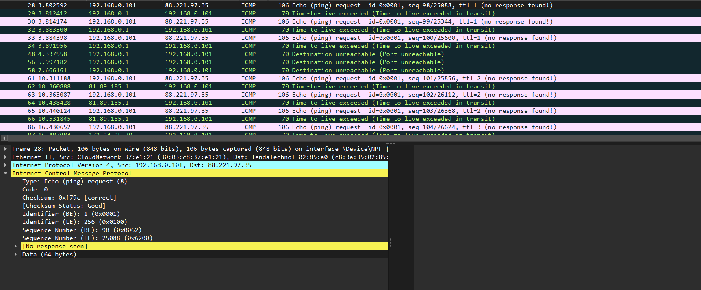
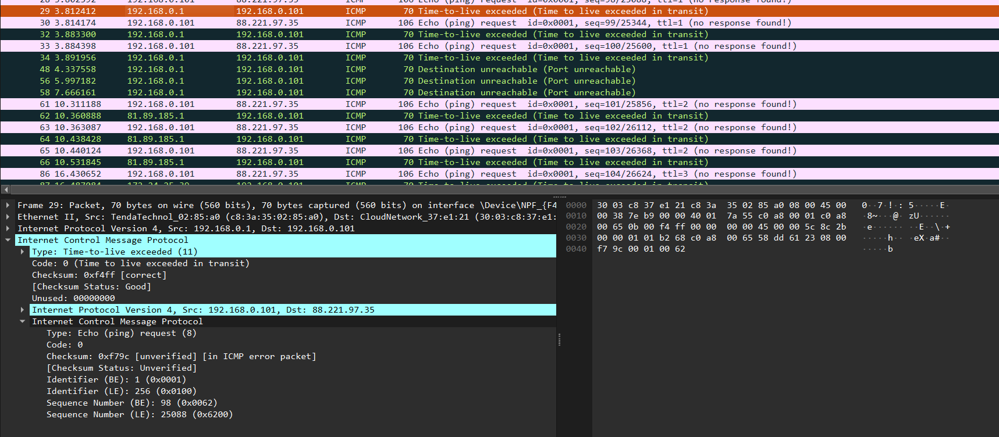
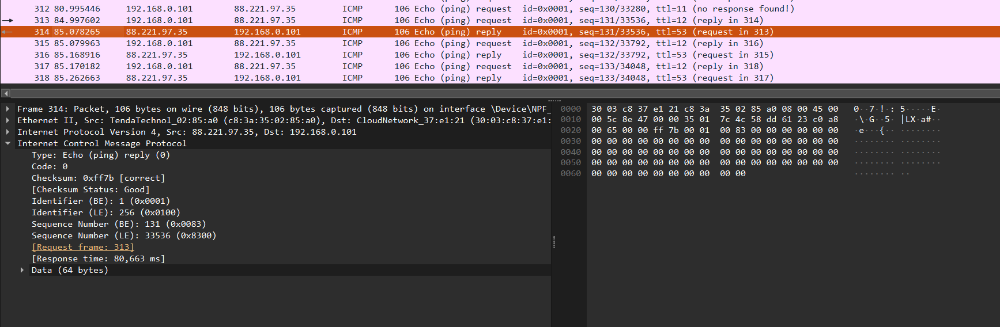
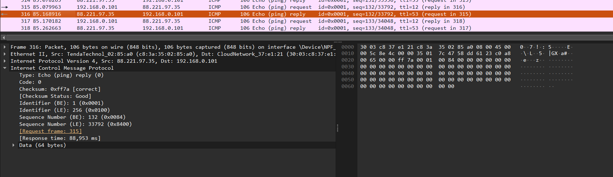
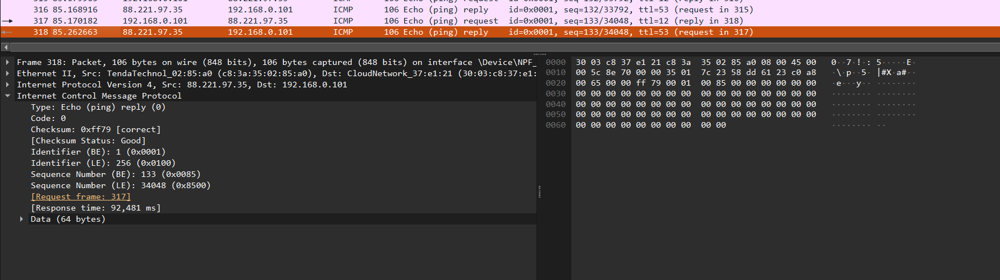
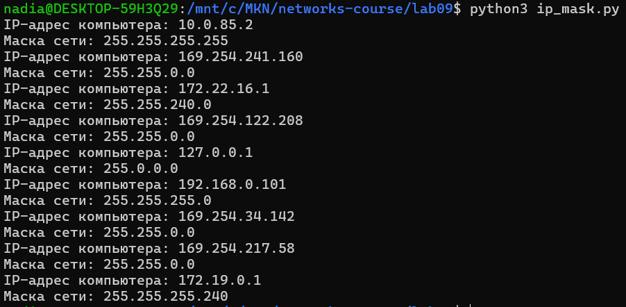
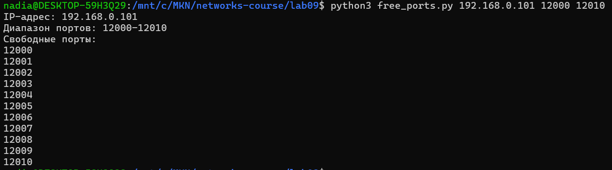

# Практика 9. Сетевой уровень

## Wireshark: ICMP
В лабораторной работе предлагается исследовать ряд аспектов протокола ICMP:
- ICMP-сообщения, генерируемые программой Ping
- ICMP-сообщения, генерируемые программой Traceroute
- Формат и содержимое ICMP-сообщения

### 1. Ping (4 балла)
Программа Ping на исходном хосте посылает пакет на целевой IP-адрес; если хост с этим адресом
активен, то программа Ping на нем откликается, отсылая ответный пакет хосту, инициировавшему
связь. Оба этих пакета Ping передаются по протоколу ICMP.

Выберите какой-либо хост, расположенный на другом континенте (например, в Америке или
Азии). Захватите с помощью Wireshark ICMP пакеты от утилиты ping.
Для этого из командной строки запустите команду (аргумент `-n 10` означает, что должно быть
отослано 10 ping-сообщений): `ping –n 10 host_name`

Для анализа пакетов в Wireshark введите строку icmp в области фильтрации вывода.

#### Вопросы
1. Каков IP-адрес вашего хоста? Каков IP-адрес хоста назначения?
   - IP-адрес моего хоста: 192.168.0.101.
   - IP-адрес хоста назначения: 128.119.245.12.
2. Почему ICMP-пакет не обладает номерами исходного и конечного портов?
   - Потому что ICMP не является транспортным протоколом. Номера портов нужны TCP и UDP для определения конкретного приложения на хосте. ICMP работает на сетевом уровне и используется для служебных сообщений.
3. Рассмотрите один из ping-запросов, отправленных вашим хостом. Каковы ICMP-тип и кодовый
   номер этого пакета? Какие еще поля есть в этом ICMP-пакете? Сколько байт приходится на поля 
   контрольной суммы, порядкового номера и идентификатора?
   - Я взяла ping-запрос в пакете №478. ICMP-тип этого пакета: Type = 8. Кодовый номер: Code = 0.
   - Еще есть поля Checksum = 0x4d5a, Identifier = 1, Sequence Number = 1 и Data. Размер ICMP-сообщения составляет 40 байт, из них 32 байта приходится на данные.
   - Поле контрольной суммы занимает 2 байта, поле идентификатора - 2 байта, поле порядкового номера - 2 байта.
4. Рассмотрите соответствующий ping-пакет, полученный в ответ на предыдущий. 
   Каковы ICMP-тип и кодовый номер этого пакета? Какие еще поля есть в этом ICMP-пакете? 
   Сколько байт приходится на поля контрольной суммы, порядкового номера и идентификатора?
   - Я взяла ping-пакет №484. ICMP-тип этого пакета: Type = 0. Кодовый номер: Code = 0.
   - В этом ICMP-пакете есть те же основные поля: Checksum = 0x555a, Identifier = 1, Sequence Number = 1 и Data. Размер ICMP-сообщения также составляет 40 байт, из них 32 байта приходится на данные.
   - Все поля опять занимают по 2 байта

### 2. Traceroute (4 балла)
Программа Traceroute может применяться для определения пути, по которому пакет попал с
исходного на конечный хост.

Traceroute отсылает первый пакет со значением TTL = 1, второй – с TTL = 2 и т.д. Каждый
маршрутизатор понижает TTL-значение пакета, когда пакет проходит через этот маршрутизатор.
Когда на маршрутизатор приходит пакет со значением TTL = 1, этот маршрутизатор отправляет
обратно к источнику ICMP-пакет, свидетельствующий об ошибке.

Задача – захватить ICMP пакеты, инициированные программой traceroute, в сниффере Wireshark.
В ОС Windows вы можете запустить: `tracert host_name`

Выберите хост, который **расположен на другом континенте**.

#### Вопросы
1. Рассмотрите ICMP-пакет с эхо-запросом на вашем скриншоте. Отличается ли он от ICMP-пакетов
   с ping-запросами из Задания 1 (Ping)? Если да – то как?
   - Если в моём захвате можно рассмотреть пакет №28: 192.168.0.101 → 88.221.97.35, Type = 8, Code = 0, то можно увидеть отличие в IP-заголовке: у traceroute/tracert значение TTL специально изменяется. Первый набор запросов отправляется с TTL = 1, затем с TTL = 2, затем с TTL = 3 и так далее. Ещё в данном захвате размер ICMP-данных у tracert равен 64 байта, тогда как в предыдущем ping-захвате было 32 байта данных.
2. Рассмотрите на вашем скриншоте ICMP-пакет с сообщением об ошибке. В нем больше полей,
   чем в ICMP-пакете с эхо-запросом. Какая информация содержится в этих дополнительных полях?
   - Рассмотрим пакет №29. У него Type = 11, Code = 0. В дополнительных полях такого ICMP-пакета содержится информация об исходном пакете, который вызвал ошибку: вложенный IP-заголовок исходного пакета и первые байты исходного ICMP Echo request. Внутри пакета ошибки видно, что исходный пакет был отправлен от 192.168.0.101 к 88.221.97.35, имел ICMP Type = 8, Code = 0, Identifier = 1, Sequence Number = 98.
3. Рассмотрите три последних ICMP-пакета, полученных исходным хостом. Чем эти пакеты
   отличаются от ICMP-пакетов, сообщающих об ошибках? Чем объясняются такие отличия?
   - Три последних ICMP-пакета, полученных исходным хостом, - это пакеты №314, №316 и №318. Они пришли от конечного хоста 88.221.97.35 к моему хосту 192.168.0.101. В отличие от ICMP-пакетов с ошибкой, у них Type = 0, Code = 0, то есть это обычные Echo reply, а не Time-to-live exceeded.
   - Это объясняется тем, что последние Echo request дошли до конечного хоста. Пока значение TTL было слишком маленьким, пакеты завершались на промежуточных маршрутизаторах, и эти маршрутизаторы отправляли ICMP-сообщения об ошибке Time-to-live exceeded. Когда TTL стал достаточно большим, пакет дошёл до узла назначения 88.221.97.35, поэтому ответ отправил уже сам конечный хост в виде обычного ICMP Echo reply.
4. Есть ли такой канал, задержка в котором существенно превышает среднее значение? Можете
   ли вы, опираясь на имена маршрутизаторов, определить местоположение двух маршрутизаторов,
   расположенных на обоих концах этого канала?
   - Да, в захвате есть участок, где задержка заметно возрастает. Например, для hop с TTL = 5 ответы от 195.70.206.129 приходили примерно за 6–11 мс, а для hop с TTL = 6 ответы от 100.105.102.17 приходили уже примерно за 73–654 мс. То есть повышенная задержка появляется на участке между маршрутизаторами 195.70.206.129 и 100.105.102.17, либо рядом с ним.
   - Надёжно определить местоположение обоих маршрутизаторов по именам в этом захвате нельзя, потому что для большинства промежуточных маршрутизаторов обратные DNS-имена не раскрылись.

## Программирование.

### 1. IP-адрес и маска сети (1 балл)
Напишите консольное приложение, которое выведет IP-адрес вашего компьютера и маску сети на консоль.

#### Демонстрация работы

### 2. Доступные порты (2 балла)
Выведите все доступные (свободные) порты в указанном диапазоне для заданного IP-адреса. 
IP-адрес и диапазон портов должны передаваться в виде входных параметров.

#### Демонстрация работы

### 3. Широковещательная рассылка для подсчета копий приложения (6 баллов)
Разработать приложение, подсчитывающее количество копий себя, запущенных в локальной сети.
Приложение должно использовать набор сообщений, чтобы информировать другие приложения
о своем состоянии. После запуска приложение должно рассылать широковещательное сообщение
о том, что оно было запущено. Получив сообщение о запуске другого приложения, оно должно
сообщать этому приложению о том, что оно работает. Перед завершением работы приложение
должно информировать все известные приложения о том, что оно завершает работу. На экран
должен выводиться список IP адресов компьютеров (с указанием портов), на которых приложение
запущено.

Приложение считает другое приложение запущенным, если в течение промежутка времени,
равного нескольким интервалам между рассылками широковещательных сообщений, от него
пришло сообщение.

**Такое приложение может быть использовано, например, при наличии ограничения на
количество лицензионных копий программ.*

Пример GUI:

#### Демонстрация работы
todo

## Задачи. Работа протокола TCP

### Задача 1. Докажите формулы (3 балла)
Пусть за период времени, в который изменяется скорость соединения с $\frac{W}{2 \cdot RTT}$
до $\frac{W}{RTT}$, только один пакет был потерян (очень близко к концу периода).
1. Докажите, что частота потери $L$ (доля потерянных пакетов) равна
   $$L = \dfrac{1}{\frac{3}{8} W^2 + \frac{3}{4} W}$$
2. Используйте выше полученный результат, чтобы доказать, что, если частота потерь равна
   $L$, то средняя скорость приблизительно равна
   $$\approx \dfrac{1.22 \cdot MSS}{RTT \cdot \sqrt{L}}$$

#### Решение
todo

### Задача 2. Найдите функциональную зависимость (3 балла)
Рассмотрим модификацию алгоритма управления перегрузкой протокола TCP. Вместо
аддитивного увеличения, мы можем использовать мультипликативное увеличение. 
TCP-отправитель увеличивает размер своего окна в небольшую положительную 
константу $a$ ($a > 1$), как только получает верный ACK-пакет.
1. Найдите функциональную зависимость между частотой потерь $L$ и максимальным
размером окна перегрузки $W$.
2. Докажите, что для этого измененного протокола TCP, независимо от средней пропускной
способности, TCP-соединение всегда требуется одинаковое количество времени для
увеличения размера окна перегрузки с $\frac{W}{2}$ до $W$.

#### Решение
todo
